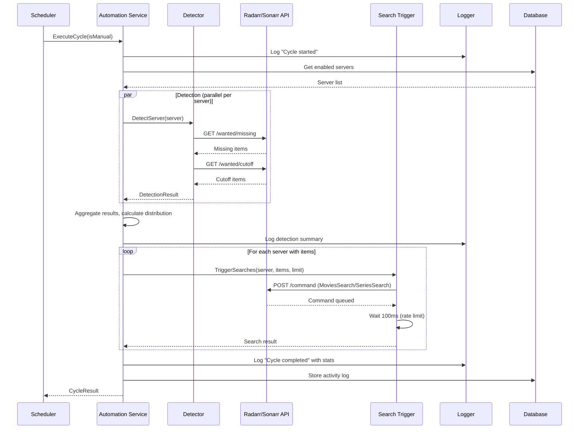
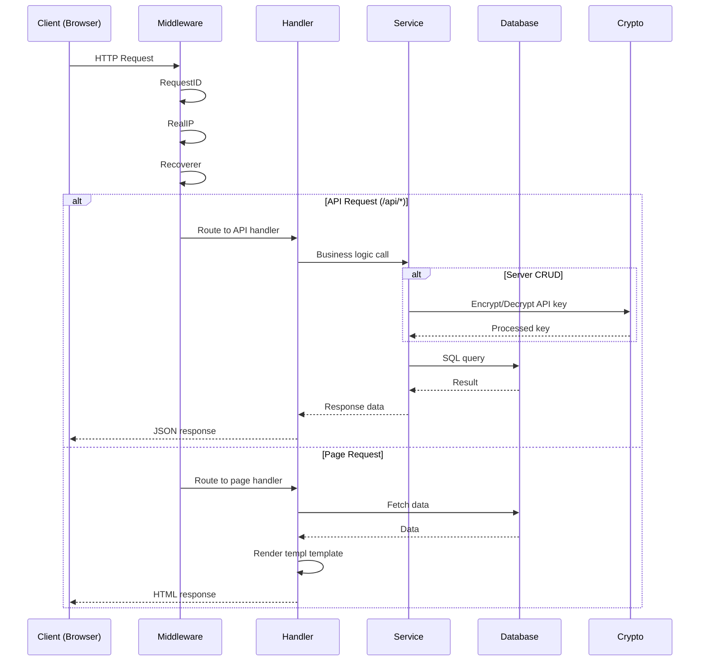
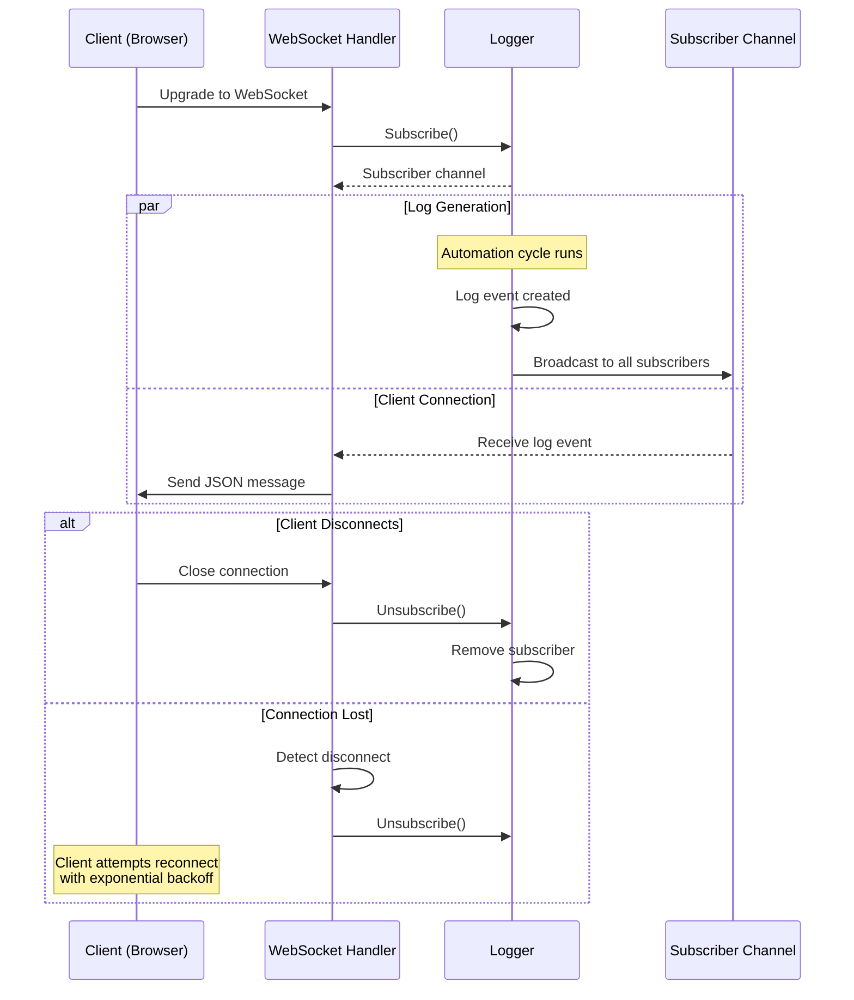

# Go Architecture Specification

## Overview

This document describes the Go-specific architecture, patterns, and conventions used in Janitarr. It serves as a reference for developers working on the codebase.

## Project Structure

```
janitarr/
├── src/                          # All Go source code
│   ├── main.go                   # Entry point
│   ├── cli/                      # Cobra CLI commands
│   │   ├── root.go               # Root command with global flags
│   │   ├── start.go              # Production mode startup
│   │   ├── dev.go                # Development mode startup
│   │   ├── server.go             # Server management subcommands
│   │   ├── config.go             # Configuration subcommands
│   │   ├── run.go                # Manual automation cycle
│   │   ├── scan.go               # Detection only
│   │   ├── status.go             # Status display
│   │   └── logs.go               # Log viewing
│   ├── config/                   # Configuration management
│   │   └── config.go             # Viper-based config
│   ├── crypto/                   # Encryption utilities
│   │   ├── crypto.go             # AES-256-GCM implementation
│   │   └── crypto_test.go
│   ├── database/                 # SQLite database layer
│   │   ├── database.go           # Connection and migration
│   │   ├── servers.go            # Server CRUD
│   │   ├── config.go             # App config storage
│   │   ├── logs.go               # Activity log storage
│   │   └── *_test.go
│   ├── api/                      # External API clients
│   │   ├── client.go             # Base HTTP client
│   │   ├── radarr.go             # Radarr API
│   │   ├── sonarr.go             # Sonarr API
│   │   └── *_test.go
│   ├── services/                 # Business logic
│   │   ├── server_manager.go     # Server management
│   │   ├── detector.go           # Content detection
│   │   ├── search_trigger.go     # Search triggering
│   │   ├── automation.go         # Cycle orchestration
│   │   ├── scheduler.go          # Scheduled execution
│   │   └── *_test.go
│   ├── web/                      # HTTP server
│   │   ├── server.go             # Chi router setup
│   │   ├── middleware/           # HTTP middleware
│   │   ├── handlers/
│   │   │   ├── api/              # REST API handlers
│   │   │   └── pages/            # Page handlers
│   │   └── websocket/            # WebSocket handlers
│   ├── logger/                   # Activity logging
│   │   ├── logger.go
│   │   └── logger_test.go
│   ├── metrics/                  # Prometheus metrics
│   │   └── metrics.go
│   └── templates/                # templ templates
│       ├── layouts/
│       ├── components/
│       └── pages/
├── static/                       # Static assets
│   ├── css/
│   └── js/
├── migrations/                   # SQL migration files
├── tests/                        # Integration/E2E tests
├── go.mod
├── go.sum
└── Makefile
```

## Core Patterns

### Error Handling

Use Go's idiomatic error handling with wrapped errors for context:

```go
import "fmt"

func (s *ServerManager) AddServer(name, url, apiKey, serverType string) (*ServerInfo, error) {
    // Validate inputs
    if name == "" {
        return nil, fmt.Errorf("server name is required")
    }

    // Check for duplicates
    existing, err := s.db.GetServerByName(name)
    if err != nil {
        return nil, fmt.Errorf("checking for duplicate: %w", err)
    }
    if existing != nil {
        return nil, fmt.Errorf("server with name %q already exists", name)
    }

    // Test connection
    if _, err := s.testConnection(url, apiKey, serverType); err != nil {
        return nil, fmt.Errorf("connection test failed: %w", err)
    }

    // Create server
    server, err := s.db.AddServer(name, url, apiKey, serverType)
    if err != nil {
        return nil, fmt.Errorf("saving server: %w", err)
    }

    return server, nil
}
```

### Dependency Injection

Services receive their dependencies through constructors:

```go
type ServerManager struct {
    db     *database.DB
    crypto *crypto.Crypto
}

func NewServerManager(db *database.DB, crypto *crypto.Crypto) *ServerManager {
    return &ServerManager{
        db:     db,
        crypto: crypto,
    }
}
```

### Concurrency

Use Go's standard concurrency patterns:

```go
// Scheduler with mutex for state protection
type Scheduler struct {
    mu          sync.Mutex
    running     bool
    cycleActive bool
    nextRunTime time.Time
    timer       *time.Timer
    callback    func(isManual bool) error
    stopCh      chan struct{}
}

// Parallel detection across servers
func (d *Detector) DetectAll() (*DetectionResults, error) {
    servers, err := d.db.ListServers()
    if err != nil {
        return nil, err
    }

    results := make(chan DetectionResult, len(servers))
    var wg sync.WaitGroup

    for _, server := range servers {
        if !server.Enabled {
            continue
        }
        wg.Add(1)
        go func(s Server) {
            defer wg.Done()
            result := d.detectServer(s)
            results <- result
        }(server)
    }

    wg.Wait()
    close(results)

    // Aggregate results
    var aggregated DetectionResults
    for r := range results {
        aggregated.Results = append(aggregated.Results, r)
    }

    return &aggregated, nil
}
```

### Context for Cancellation

Use context.Context for cancellation and timeouts:

```go
func (c *Client) Get(ctx context.Context, path string, result interface{}) error {
    req, err := http.NewRequestWithContext(ctx, "GET", c.baseURL+path, nil)
    if err != nil {
        return err
    }

    req.Header.Set("X-Api-Key", c.apiKey)

    resp, err := c.httpClient.Do(req)
    if err != nil {
        return fmt.Errorf("request failed: %w", err)
    }
    defer resp.Body.Close()

    if resp.StatusCode != http.StatusOK {
        return fmt.Errorf("unexpected status: %d", resp.StatusCode)
    }

    return json.NewDecoder(resp.Body).Decode(result)
}
```

## Architecture Flow Diagrams

These diagrams illustrate the key data flows in Janitarr.

### Automation Cycle Flow

The core automation cycle coordinates detection and search triggering across configured servers:



### Web Request Flow

HTTP requests flow through Chi router middleware to handlers and services:



### WebSocket Log Streaming Flow

Real-time log streaming uses WebSocket connections with a pub/sub pattern:



## Database Layer

### SQLite with modernc.org/sqlite

Pure Go implementation, no CGO required:

```go
import (
    "database/sql"
    _ "modernc.org/sqlite"
)

type DB struct {
    conn   *sql.DB
    crypto *crypto.Crypto
}

func New(dbPath, keyPath string) (*DB, error) {
    conn, err := sql.Open("sqlite", dbPath)
    if err != nil {
        return nil, fmt.Errorf("opening database: %w", err)
    }

    // Enable WAL mode for better concurrency
    if _, err := conn.Exec("PRAGMA journal_mode=WAL"); err != nil {
        return nil, fmt.Errorf("enabling WAL: %w", err)
    }

    crypto, err := crypto.LoadOrCreate(keyPath)
    if err != nil {
        return nil, fmt.Errorf("loading crypto: %w", err)
    }

    db := &DB{conn: conn, crypto: crypto}
    if err := db.migrate(); err != nil {
        return nil, fmt.Errorf("migration: %w", err)
    }

    return db, nil
}
```

### Migrations

SQL migrations stored in `migrations/` directory:

```go
//go:embed migrations/*.sql
var migrations embed.FS

func (db *DB) migrate() error {
    entries, err := migrations.ReadDir("migrations")
    if err != nil {
        return err
    }

    for _, entry := range entries {
        content, err := migrations.ReadFile("migrations/" + entry.Name())
        if err != nil {
            return err
        }

        if _, err := db.conn.Exec(string(content)); err != nil {
            return fmt.Errorf("running %s: %w", entry.Name(), err)
        }
    }

    return nil
}
```

## Web Server

### Chi Router

```go
func NewServer(db *database.DB, scheduler *services.Scheduler, logger *logger.Logger) *Server {
    r := chi.NewRouter()

    // Middleware
    r.Use(middleware.RequestID)
    r.Use(middleware.RealIP)
    r.Use(middleware.Recoverer)

    // API routes
    r.Route("/api", func(r chi.Router) {
        r.Get("/health", handlers.Health(db, scheduler))
        r.Get("/config", handlers.GetConfig(db))
        r.Patch("/config", handlers.UpdateConfig(db))

        r.Route("/servers", func(r chi.Router) {
            r.Get("/", handlers.ListServers(db))
            r.Post("/", handlers.CreateServer(db))
            r.Get("/{id}", handlers.GetServer(db))
            r.Put("/{id}", handlers.UpdateServer(db))
            r.Delete("/{id}", handlers.DeleteServer(db))
        })

        r.Get("/logs", handlers.GetLogs(db))
        r.Delete("/logs", handlers.ClearLogs(db))

        r.Post("/automation/trigger", handlers.TriggerCycle(scheduler))
        r.Get("/automation/status", handlers.GetStatus(scheduler))
    })

    // Page routes (templ templates)
    r.Get("/", handlers.Dashboard(db, scheduler))
    r.Get("/servers", handlers.ServersPage(db))
    r.Get("/logs", handlers.LogsPage(db))
    r.Get("/settings", handlers.SettingsPage(db))

    // Static files
    r.Handle("/static/*", http.StripPrefix("/static/", http.FileServer(http.Dir("static"))))

    // WebSocket
    r.Get("/ws/logs", websocket.LogsHandler(logger))

    return &Server{router: r, db: db, scheduler: scheduler}
}
```

### HTTP Handlers

Table-driven handler tests:

```go
func TestGetServers(t *testing.T) {
    tests := []struct {
        name       string
        setup      func(db *database.DB)
        wantStatus int
        wantBody   string
    }{
        {
            name:       "empty list",
            setup:      func(db *database.DB) {},
            wantStatus: http.StatusOK,
            wantBody:   "[]",
        },
        {
            name: "with servers",
            setup: func(db *database.DB) {
                db.AddServer("test", "http://localhost:7878", "key", "radarr")
            },
            wantStatus: http.StatusOK,
        },
    }

    for _, tt := range tests {
        t.Run(tt.name, func(t *testing.T) {
            db := testDB(t)
            tt.setup(db)

            req := httptest.NewRequest("GET", "/api/servers", nil)
            w := httptest.NewRecorder()

            handlers.ListServers(db).ServeHTTP(w, req)

            if w.Code != tt.wantStatus {
                t.Errorf("got status %d, want %d", w.Code, tt.wantStatus)
            }
        })
    }
}
```

## templ Templates

### Component Pattern

```go
// templates/components/server_card.templ
package components

import "janitarr/src/database"

templ ServerCard(server database.Server) {
    <div class="bg-white dark:bg-gray-800 rounded-lg shadow p-4">
        <div class="flex items-center justify-between">
            <div>
                <h3 class="font-semibold text-lg">{ server.Name }</h3>
                <span class={
                    "px-2 py-1 text-xs rounded",
                    templ.KV("bg-blue-100 text-blue-800", server.Type == "radarr"),
                    templ.KV("bg-purple-100 text-purple-800", server.Type == "sonarr"),
                }>
                    { server.Type }
                </span>
            </div>
            <div class="flex gap-2">
                <button
                    hx-post={ "/api/servers/" + server.ID + "/test" }
                    hx-swap="none"
                    class="btn btn-secondary"
                >
                    Test
                </button>
                <button
                    hx-get={ "/servers/" + server.ID + "/edit" }
                    hx-target="#modal"
                    class="btn btn-primary"
                >
                    Edit
                </button>
            </div>
        </div>
    </div>
}
```

### Layout Pattern

```go
// templates/layouts/base.templ
package layouts

templ Base(title string) {
    <!DOCTYPE html>
    <html lang="en" x-data="{ darkMode: localStorage.getItem('darkMode') === 'true' }" :class="{ 'dark': darkMode }">
    <head>
        <meta charset="UTF-8"/>
        <meta name="viewport" content="width=device-width, initial-scale=1.0"/>
        <title>{ title } - Janitarr</title>
        <link href="/static/css/app.css" rel="stylesheet"/>
        <script src="/static/js/htmx.min.js"></script>
        <script src="/static/js/alpine.min.js" defer></script>
    </head>
    <body class="bg-gray-100 dark:bg-gray-900 text-gray-900 dark:text-gray-100">
        <div class="flex h-screen">
            @Nav()
            <main class="flex-1 overflow-auto p-6">
                { children... }
            </main>
        </div>
        <div id="modal"></div>
    </body>
    </html>
}
```

## CLI with Cobra

### Command Structure

```go
// cli/root.go
package cli

import (
    "github.com/spf13/cobra"
)

var (
    dbPath string
)

func NewRootCmd() *cobra.Command {
    cmd := &cobra.Command{
        Use:   "janitarr",
        Short: "Automation tool for Radarr and Sonarr",
        Long:  `Janitarr automates content discovery and search triggering for media servers.`,
    }

    cmd.PersistentFlags().StringVar(&dbPath, "db-path", "./data/janitarr.db", "Path to database file")

    cmd.AddCommand(
        newStartCmd(),
        newDevCmd(),
        newServerCmd(),
        newConfigCmd(),
        newRunCmd(),
        newScanCmd(),
        newStatusCmd(),
        newLogsCmd(),
    )

    return cmd
}

// cli/start.go
func newStartCmd() *cobra.Command {
    var port int
    var host string

    cmd := &cobra.Command{
        Use:   "start",
        Short: "Start scheduler and web server (production mode)",
        RunE: func(cmd *cobra.Command, args []string) error {
            return runStart(port, host, false)
        },
    }

    cmd.Flags().IntVarP(&port, "port", "p", 3434, "Port to listen on")
    cmd.Flags().StringVarP(&host, "host", "H", "localhost", "Host to bind to")

    return cmd
}
```

## Configuration Precedence

Configuration values can come from multiple sources. When the same setting is specified in multiple places, the following precedence order applies (highest to lowest):

1. **CLI flags** (`--port`, `--host`, `--db-path`, `--log-level`)
2. **Environment variables** (`JANITARR_*`)
3. **Database-stored configuration** (automation settings, server configs)
4. **Hardcoded defaults**

This means CLI flags always override environment variables, which override database settings. For example:

```bash
# CLI flag wins - server runs on port 8080
JANITARR_WEB_PORT=3000 ./janitarr start --port 8080

# Env var wins over database default - server runs on port 3000
JANITARR_WEB_PORT=3000 ./janitarr start

# Database or hardcoded default used - server runs on port 3434
./janitarr start
```

Note: Not all settings are available at all levels. Automation settings (schedule interval, search limits) are typically only in the database, while runtime settings (port, host, log level) are available via CLI/environment.

## Testing

### Test Utilities

```go
// testutil/db.go
package testutil

import (
    "testing"
    "janitarr/src/database"
)

func TestDB(t *testing.T) *database.DB {
    t.Helper()
    db, err := database.New(":memory:", t.TempDir()+"/key")
    if err != nil {
        t.Fatalf("creating test db: %v", err)
    }
    t.Cleanup(func() { db.Close() })
    return db
}
```

### Mock HTTP Server

```go
func TestRadarrClient_GetMissing(t *testing.T) {
    srv := httptest.NewServer(http.HandlerFunc(func(w http.ResponseWriter, r *http.Request) {
        if r.URL.Path != "/api/v3/wanted/missing" {
            t.Errorf("unexpected path: %s", r.URL.Path)
        }
        if r.Header.Get("X-Api-Key") != "test-key" {
            t.Error("missing API key header")
        }

        json.NewEncoder(w).Encode(map[string]interface{}{
            "totalRecords": 5,
            "records": []map[string]interface{}{
                {"id": 1, "title": "Movie 1"},
            },
        })
    }))
    defer srv.Close()

    client := api.NewRadarrClient(srv.URL, "test-key")
    result, err := client.GetMissing(1, 10)
    if err != nil {
        t.Fatalf("GetMissing: %v", err)
    }

    if result.TotalRecords != 5 {
        t.Errorf("got %d records, want 5", result.TotalRecords)
    }
}
```

## Metrics

### Prometheus Format

```go
package metrics

import (
    "fmt"
    "sync/atomic"
    "time"
)

type Metrics struct {
    startTime        time.Time
    cyclesTotal      uint64
    cyclesFailed     uint64
    searchesTriggered map[string]*uint64 // key: "radarr_missing", etc.
    httpRequests     map[string]*uint64  // key: "GET_/api/servers_200"
}

func (m *Metrics) Render() string {
    uptime := time.Since(m.startTime).Seconds()

    var b strings.Builder
    fmt.Fprintf(&b, "# HELP janitarr_uptime_seconds Time since process start\n")
    fmt.Fprintf(&b, "# TYPE janitarr_uptime_seconds counter\n")
    fmt.Fprintf(&b, "janitarr_uptime_seconds %.0f\n", uptime)

    fmt.Fprintf(&b, "# HELP janitarr_scheduler_cycles_total Total automation cycles\n")
    fmt.Fprintf(&b, "# TYPE janitarr_scheduler_cycles_total counter\n")
    fmt.Fprintf(&b, "janitarr_scheduler_cycles_total %d\n", atomic.LoadUint64(&m.cyclesTotal))

    // ... more metrics

    return b.String()
}
```

## Development Workflow

### Makefile

```makefile
.PHONY: build test generate

generate:
	templ generate
	npx tailwindcss -i ./static/css/input.css -o ./static/css/app.css

build: generate
	go build -ldflags "-s -w" -o janitarr ./src

test:
	go test -race ./...
```

## Security Considerations

### API Key Encryption

- AES-256-GCM encryption for API keys at rest
- Encryption key stored in `data/.janitarr.key`
- Key is 32 bytes, base64 encoded for storage
- Never log decrypted API keys

### Input Validation

- Validate all user inputs
- Sanitize URLs (normalize, validate protocol)
- Limit request body sizes
- Use parameterized SQL queries

### Network Security

- Default bind to localhost (prevents external access)
- Explicit `--host 0.0.0.0` required for external access
- No authentication in v1 (network-level access control)
